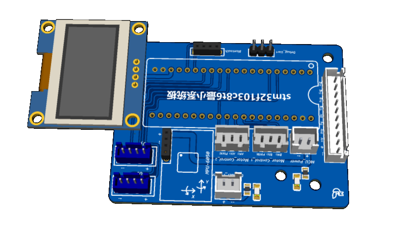
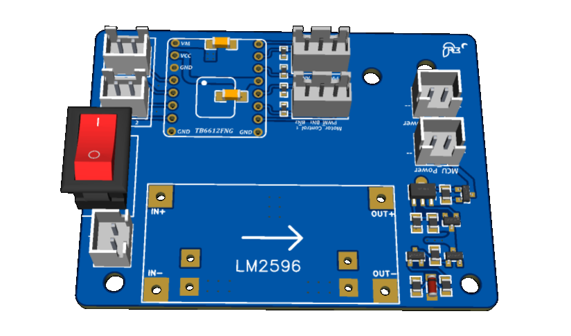
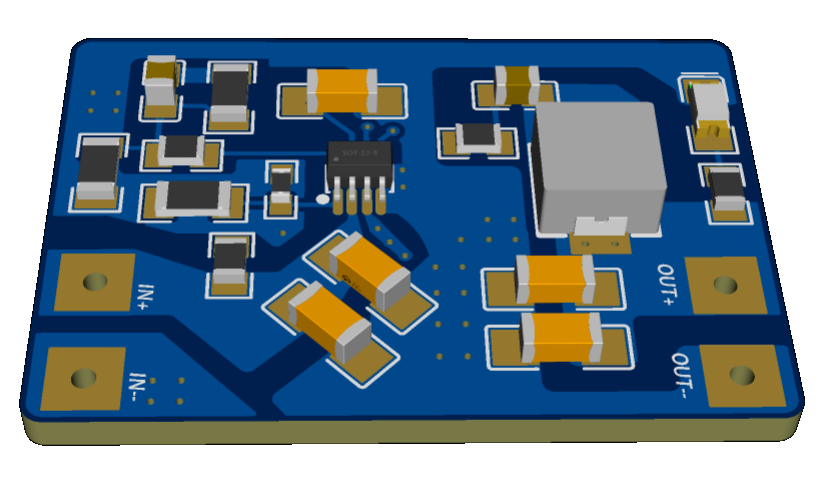
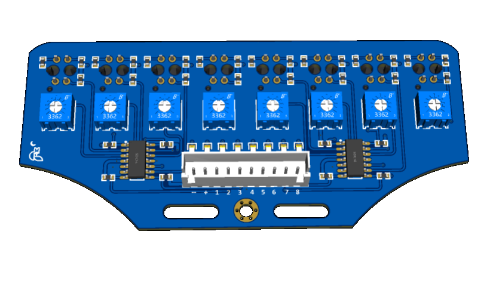

   
  <h1>Balance-Car</h1>

 

  
  
  
  

# 演示

# 板子

# 注意
- 焊接板子的时候，需要注意插座元件的朝向
- 最好以mpu6050的定时器中断作为任务调度基准(PCB内没有相关的线路连接)

# 声明
<a href="https://github.com/Rev-RoastedDuck/Balance-Car">Balance-Car</a> 采用Apache 许可证 2.0 (Apache License 2.0) 授权发布。
